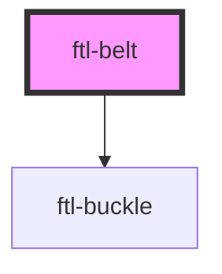

# ftl-belt

<!-- Auto Generated Below -->

## Properties

| Property      | Attribute      | Description                                                                                           | Type     | Default     |
| ------------- | -------------- | ----------------------------------------------------------------------------------------------------- | -------- | ----------- |
| `accessToken` | `access-token` | Your Figma Personal Access Token. Find it under account settings from the top-left menu inside Figma. | `string` | `undefined` |
| `fileId`      | `file-id`      | Your Figma file ID. https://www.figma.com/file/MYFILEID/my-file                                       | `string` | `undefined` |

## Dependencies

### Depends on

- [ftl-buckle](../ftl-buckle)

### Graph

----------------------------------------------

*Built with [StencilJS](https://stenciljs.com/)*
