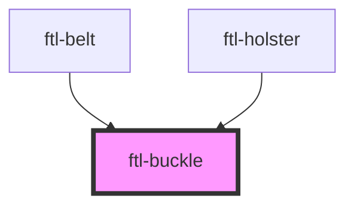

# ftl-buckle

<!-- Auto Generated Below -->

## Properties

| Property       | Attribute       | Description | Type                                      | Default    |
| -------------- | --------------- | ----------- | ----------------------------------------- | ---------- |
| `activeToggle` | `active-toggle` |             | `string`                                  | `'figma'`  |
| `mode`         | `mode`          |             | `string`                                  | `'side'`   |
| `opacity`      | `opacity`       |             | `string`                                  | `'1'`      |
| `showGrid`     | `show-grid`     |             | `boolean`                                 | `true`     |
| `view`         | `view`          |             | `"overlay" \| "side-by-side" \| "toggle"` | `'toggle'` |

## Events

| Event           | Description | Type                                                                                                |
| --------------- | ----------- | --------------------------------------------------------------------------------------------------- |
| `ftl-on-change` |             | `CustomEvent<{ attribute: "view" \| "show-grid" \| "active-toggle" \| "opacity"; value: string; }>` |

## Shadow Parts

| Part               | Description |
| ------------------ | ----------- |
| `"base"`           |             |
| `"holster-option"` |             |

## Dependencies

### Used by

 - [ftl-belt](../ftl-belt)
 - [ftl-holster](../ftl-holster)

### Graph

----------------------------------------------

*Built with [StencilJS](https://stenciljs.com/)*
